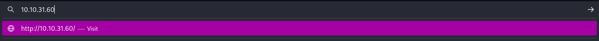
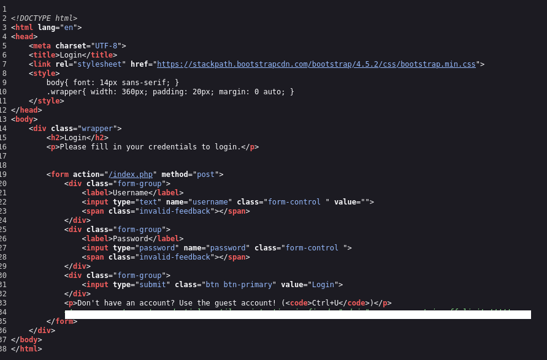
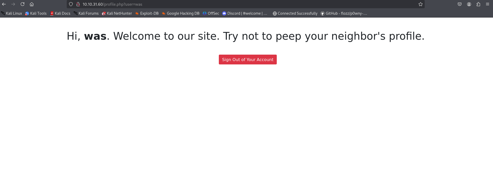
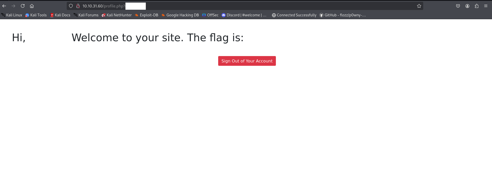

<H1><a href="https://tryhackme.com/room/neighbour">NEIGHBOUR</a></H1>

<H3>TryHackMe-Neighbour room was a Challenge that more focused on "IDOR"/Insecure direct object references problem.</H3>

Hello Hacker!, even though there might be no one will see this writeup, because the challenges is WAY to easy.. ( Yea, it only cost 5 min ._. )

But i spend my time to make this writeup, because there might be someone out there that have difficulties on this Easy challenges ( Yea, It's you! )

SO.. Don't waste time, and let's get hacking!!

<H2>## Input the Target IP to Browser</H2>

After you input the target IP Machine to your virtual machine browser/Attackbox Browser. You will found Login page

Here's the easiest part, just type the Ctrl + U, it will led you to view-source page

And here's where we get leaked information!, you'll found it when you do the same as i do

So just type the input to login page

Yup!, We finally enter the Cloud

<H2>## IDOR Vulnerabilities</H2>

And here's where the IDOR is exist

If you see the parameter "user" in the search bar, you notice that our username "guest" is exist

That mean the username are visible in the search bar

Let's try change the parameter

Now you see that the parameter are easily changed even without password ( Hope there's no website that have issues like this )

<H2>## CAPTURE THE FLAG</H2>

Change the parameter to your neighbour usernames ( Not your real neighbour ._.)

The clue is inside the view-page source that we have found before.

You got it?, Cool!

Even though this is WAY too easy, but atleast it can get yourself a knowledge or new insight about IDOR ( If you are really new in this field )

<H3>SO That's for Neighbour writeup, Thank you for visiting:D </H3>
